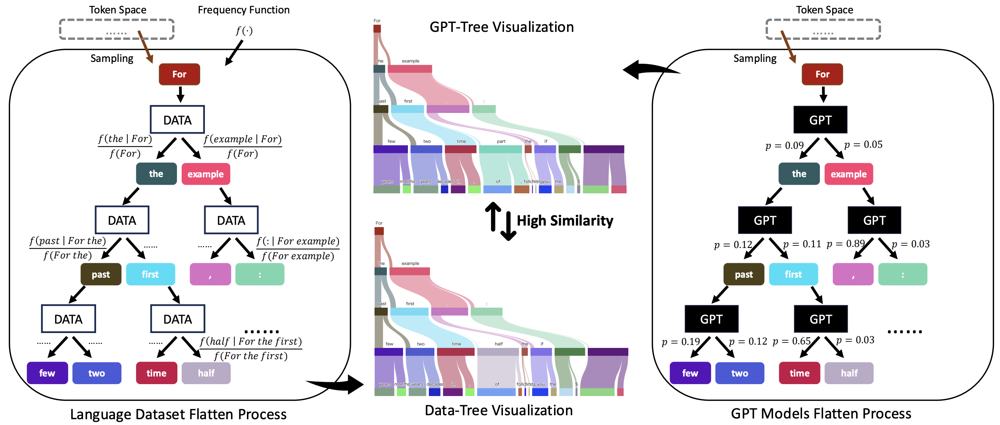
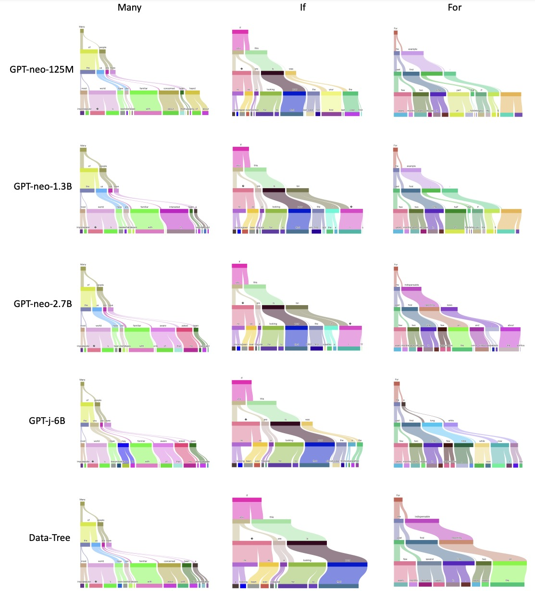
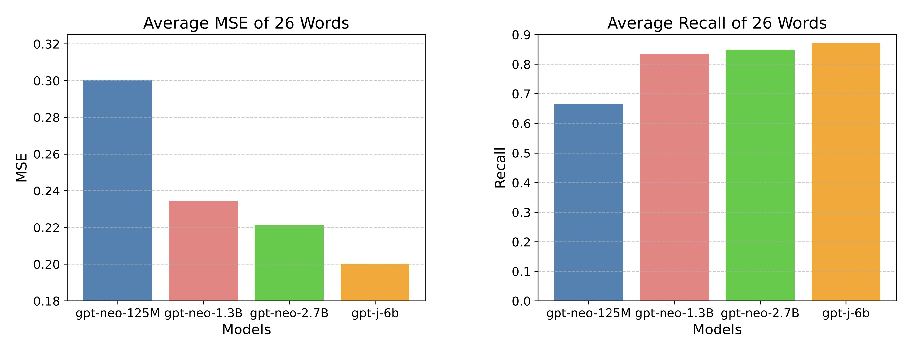
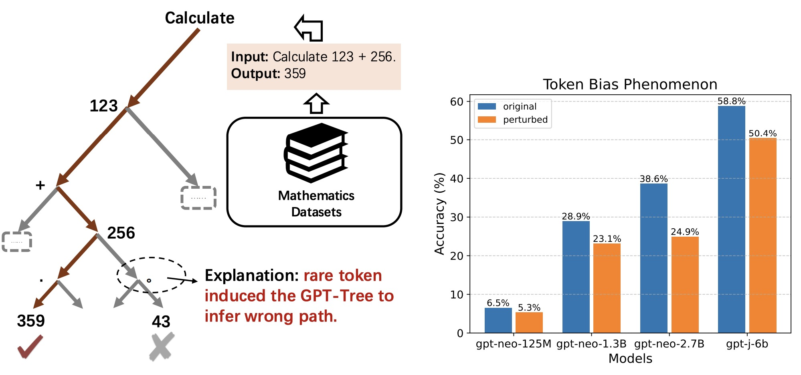
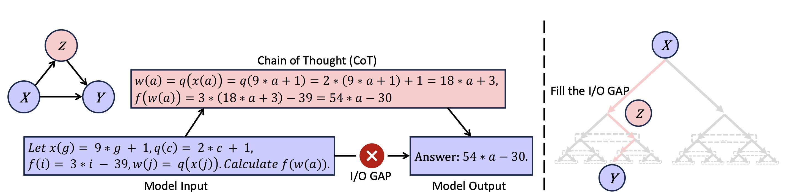

<h1 align="center"> <a href="https://arxiv.org/pdf/2501.07641">GPT as a Monte Carlo Language Tree: A Probabilistic Perspective</a></h1>
<h5 align="center"> If you like our project, please give us a star ⭐ on GitHub for latest update.  </h5>

[](https://arxiv.org/pdf/2501.07641) 
[](https://github.com/PKU-YuanGroup/GPT-as-Language-Tree/blob/main/LICENSE) 

## 🤗 Brief Intro
<p align="center">

</p>

- We propose a novel perspective for analyzing the intelligent abilities of LLMs by representing both the 
language dataset and the GPT models as Monte Carlo Language Trees, named Data-Tree $\theta^*$ and GPT-Tree $\hat\theta$, respectively. 

- Quantitative analysis demonstrate that **using existing language models to fit training data essentially 
seeks a more efficient way to approximate the Data-Tree (_i.e._, $\hat\theta \rightarrow \theta^*$)**. Furthermore, 
GPT-Trees generated by different language models trained on the same dataset exhibit a high degree of similarity.

- Our findings may confirm that the reasoning process in **LLMs is more likely to be probabilistic pattern-matching rather than formal reasoning**, as each model inference seems to find a
context pattern with maximum probability from the Data-Tree.

- Our perspective of the Monte Carlo Language Tree can better explain and understand many existing counterintuitive
phenomena, such as hallucinations, CoT and token bias.

## 😮 Highlight
- ###  The GPT Models Gradually Converge to the Data-Tree
<p align="center">

</p>

The tree visualization results of GPT-X series models and Data-Tree. Each row and column represents a different 
model (or dataset) and token, respectively. These models are trained on the same large-scale 800GB dataset, _i.e._, 
The Pile. **Different GPT-like language models trained on the same dataset have very high similarity in GPT-Tree 
visualization, and gradually converge to the Data-Tree, especially on the If token** (the second column). This 
similarity is not only reflected at the token level (node color of the tree), but also at the prediction probability
level (edge width of the tree).


<p align="center">

</p>

Average MSE and Recall@5 of 26 words. The MSE measures the probability difference between the GPT-Tree and Data-Tree, 
the smaller the value, the more similar it is. The Recall@5 measures how many GPT output tokens will be recalled by 
Data-Tree. The results show that the GPT models gradually converge to the Data-Tree with increased parameter size.

- ### Understanding token bias phenomena from GPT-Tree
<p align="center">

</p>

We perturb the last token “.” into “。”, the model incorrectly answers as “43”. **We suggest that token bias is due to 
some rare tokens inducing the GPT-Tree to infer the wrong path.** We further quantified this phenomenon by evaluating 
the original (blue bars) and perturbed (orange bars) accuracy of different models in 21076 QA test pairs. The accuracy 
of all models has significantly decreased after perturbing the last token “.” into “。”, suffering from the token bias 
issues.

- ### Understanding the Effectiveness of Chain-of-Thought (CoT) from GPT-Tree
<p align="center">

</p>

For some complex issues, there is a significant gap between input X  and output Y , making it difficult for the GPT 
model to directly derive Y from X. From the perspective of GPT-Tree, the input X is at a parent node, and the output
Y is at a deep leaf node. The CoT focuses on finding a path Z to help the GPT model connect X and Y, attempting to 
fill the I/O gap.

## ✏️ Citation
If you find our paper and code useful in your research, please consider giving a star :star: and citation :pencil:.

```BibTeX
@misc{ning2025gptmontecarlolanguage,
      title={GPT as a Monte Carlo Language Tree: A Probabilistic Perspective}, 
      author={Kun-Peng Ning and Jia-Yu Yao and Yu-Yang Liu and Mu-Nan Ning and Li Yuan},
      year={2025},
      eprint={2501.07641},
      archivePrefix={arXiv},
      primaryClass={cs.CL},
      url={https://arxiv.org/abs/2501.07641}, 
}
```